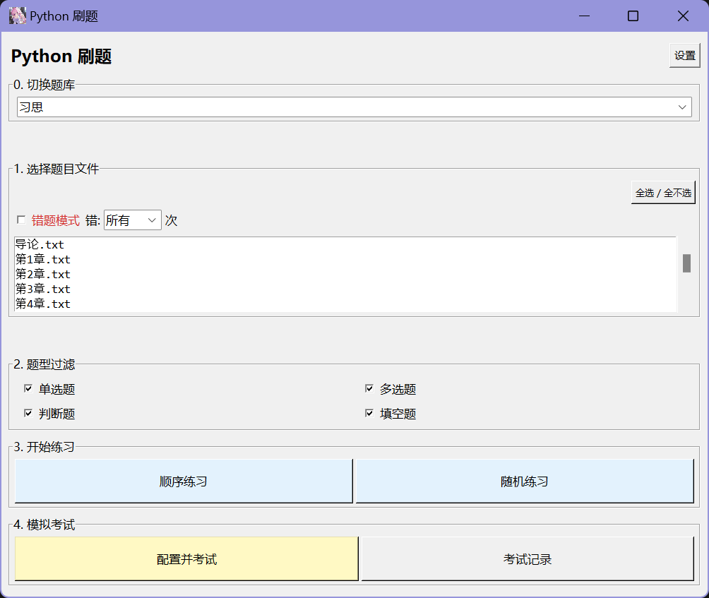

***

# 📚 Python 刷题系统 (学习通专用版)

这是一个基于 Python (Tkinter) 开发的本地轻量级刷题软件。

**核心目的：** 专为复习 **学习通 (Chaoxing)** 上的测验、作业和考试题目而设计。无需联网，支持错题回顾，**新增模拟考试模式**，支持 Android (Pydroid 3) 完美运行。



## ✨ 功能特点

### 🧠 核心刷题

*   **多题型支持**：完美解析 **单选题、多选题、判断题、填空题**。
*   **智能解析**：针对学习通网页端的复制格式进行了专门优化，一键粘贴即可识别。
*   **即时反馈**：支持“即点即判”模式，练习效率极高。
*   **错题本**：自动记录错题，支持按错误次数（1次、2次...）筛选复习。

### 🎓 模拟考试 (New!)

*   **全真模拟**：支持设置 **倒计时**，模拟真实考场压力。
*   **自定义配置**：自由设置各题型的 **题目数量** 和 **每题分值**。
*   **答题卡**：可视化的答题卡状态（已答/未答），一键跳转。
*   **成绩统计**：交卷后自动生成成绩单，计算总分和正确率。
*   **历史记录**：自动保存考试成绩，随时查看分数走势。

### 📱 移动端/Pydroid 优化 (New!)

*   **自适应布局**：针对手机竖屏进行了深度优化，表格和按钮不再“挤”在一起。
*   **文本防截断**：修复了中文括号和长选项在手机屏幕上被截断或异常换行的问题。
*   **触控友好**：增大按钮区域，点击选项文字即可选中，操作更顺手。

## 🚀 快速开始

### 1. 环境要求

*   **PC端**：安装 [Python 3.x](https://www.python.org/) 。
*   **Android端**：安装 [pydroid3](https://blog.qaiu.top/archives/pydroid3v72)
*   **依赖**：本项目仅依赖 Python 标准库（`tkinter`, `json`, `re`, `os`, `random`, `datetime`），**无需安装任何 pip 包**。

### 2. 📂 如何制作题库 (关键步骤)

本软件最核心的功能是能够直接解析学习通的网页文本。请按照以下步骤操作：

1.  在项目根目录下找到（或新建）`题库` 文件夹。
2.  在 `题库` 文件夹内新建一个子文件夹（例如：`近代史纲要`、`Python程序设计`），这将作为一个独立的题库分类。
3.  **获取题目文本**：
    *   在电脑浏览器打开学习通的 **作业**、**测验** 或 **考试查看试卷** 等页面。
    *   **全选页面内容**：使用快捷键 **`Ctrl + A`**
    *   **复制** (`Ctrl + C`) 选中的所有文字。
4.  **保存文件**：
    *   在刚才新建的子文件夹里，新建一个 `.txt` 文本文件。
    *   将复制的内容直接 **粘贴** 进去。
    *   保存并关闭，**编码格式建议使用 UTF-8**。

> **💡 提示**：只要是从学习通网页上直接复制下来的文本，通常都能完美自动识别题目。软件支持同时勾选多个 txt 文件进行混合练习。

### 3. 文件结构说明

```text
Python 刷题/
├── PS.pyw               # 主程序源码 (无控制台窗口运行)
├── config.json          # (自动生成) 用户通用设置
├── mistakes.json        # (自动生成) 错题记录数据库
├── exam_presets.json    # (自动生成) 考试配置预设
├── exam_history.json    # (自动生成) 考试历史成绩记录
├── favicon.ico          # 程序图标
└── 题库/                 # 存放题目数据的文件夹
    ├── 马克思主义原理/
    │   ├── 第一章测验.txt
    │   └── 期末模拟.txt
    └── 计算机基础/
        └── 题库1.txt
```

### 4. 运行软件

- **Windows端**：直接双击运行 PS.pyw。
- **Android端 (Pydroid 3)**：
  1. 下载整个[项目文件夹](https://github.com/Iviesever/Python-practice-questions/archive/refs/heads/master.zip)，传输到手机。
  2. 用 [pydroid3](https://blog.qaiu.top/archives/pydroid3v72) 打开项目文件夹的PS.pyw，运行

## ⚙️ 使用技巧

- **配置记忆**：软件会自动记住你上次选择的题库文件和考试配置（题数、时间），下次打开无需重复设置。
- **全选文件**：在文件列表区域，点击“全选/全不选”按钮可以快速批量操作。
- **字体调节**：如果在手机上觉得字太小，可以点击主页右上角的“⚙ 设置”调整字体大小。

## 📝 License

本项目采用 **MIT License** 开源许可证。

这意味着你可以自由地使用、复制、修改、合并、出版发行、散布、再授权及贩售本软件的副本，只需包含原作者的版权声明和许可声明即可。

------


### The MIT License (MIT)

Copyright (c) 2025 Iviesever

Permission is hereby granted, free of charge, to any person obtaining a copy of this software and associated documentation files (the "Software"), to deal in the Software without restriction, including without limitation the rights to use, copy, modify, merge, publish, distribute, sublicense, and/or sell copies of the Software, and to permit persons to whom the Software is furnished to do so, subject to the following conditions:

The above copyright notice and this permission notice shall be included in all copies or substantial portions of the Software.

THE SOFTWARE IS PROVIDED "AS IS", WITHOUT WARRANTY OF ANY KIND, EXPRESS OR IMPLIED, INCLUDING BUT NOT LIMITED TO THE WARRANTIES OF MERCHANTABILITY, FITNESS FOR A PARTICULAR PURPOSE AND NONINFRINGEMENT. IN NO EVENT SHALL THE AUTHORS OR COPYRIGHT HOLDERS BE LIABLE FOR ANY CLAIM, DAMAGES OR OTHER LIABILITY, WHETHER IN AN ACTION OF CONTRACT, TORT OR OTHERWISE, ARISING FROM, OUT OF OR IN CONNECTION WITH THE SOFTWARE OR THE USE OR OTHER DEALINGS IN THE SOFTWARE.
